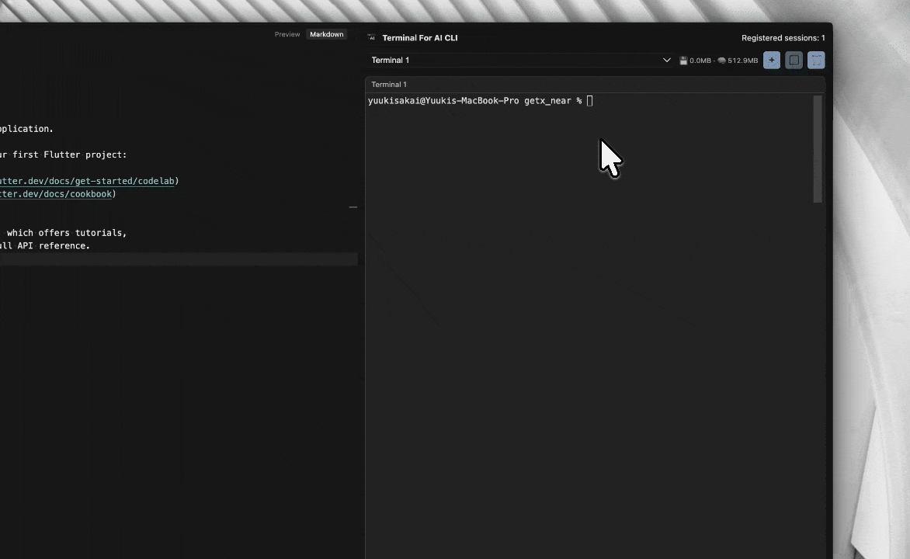
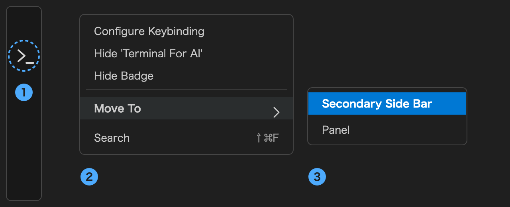

<p align="center">
  
</p>

<h1 align="center">Terminal for AI CLI</h1>

<p align="center">
  <strong>A real terminal in the sidebar, next to your AI CLI.</strong><br>
  Multi-session, split view, and drag-and-drop images — without leaving the editor.
</p>

<p align="center">
  <a href="https://github.com/den0206/terminal-for-ai-cli/releases/latest"></a>
</p>

<p align="center">
  
  
  <a href="https://opensource.org/licenses/MIT"></a>
</p>

<p align="center">
  English · <a href="README_JP.md">日本語</a>
</p>

<p align="center">
  <!-- BEGIN:release -->
  Latest release: <a href="https://github.com/den0206/terminal-for-ai-cli/releases/tag/Ver_0.3.0"><strong>Ver_0.3.0</strong></a> (2026-09-03)
  <!-- END:release -->
</p>

---

**Terminal for AI CLI** puts a full `xterm.js` terminal into the VS Code / Cursor sidebar, backed by
real PTY processes (`node-pty`). It is built for the workflow where an AI CLI runs in one pane and
you keep working in another.

> "The AI agent keeps running in the sidebar while the editor stays yours."

The main editor terminal panel steals vertical space from your code. This view lives in the
Activity Bar instead: up to two shells, side-by-side or stacked, always visible, with their own
height and theme.

<p align="center">
  
</p>

> **First step after installing**: move the view to the Secondary Side Bar so the terminal sits beside your code instead of covering the file tree.
> **Right-click the Terminal For AI icon in the Activity Bar → Move To → Secondary Side Bar.**
> Dragging the icon to the right edge of the window does the same.

<p align="center">
  
</p>

## Contents

- [What It Does](#what-it-does)
- [Quick Start](#quick-start)
- [Usage](#usage)
- [Feature Overview](#feature-overview)
- [Settings](#settings)
- [Commands](#commands)
- [Storage and Memory](#storage-and-memory)
- [Security](#security)
- [Limitations](#limitations)
- [Troubleshooting](#troubleshooting)
- [Development](#development) / [Releasing](#releasing)
- [Links](#links)

## What It Does

- **Two shells in the sidebar** — add, switch, and close sessions from the toolbar dropdown.
- **Split view** — show both sessions at once, with a draggable divider between them.
- **Scrollback survives reloads** — output is buffered per session and replayed when the Webview reloads.
- **Stable names** — `Terminal 1`, `Terminal 2`, … and freed numbers get reused.
- **Drag an image in** — hold `Shift` and drop; the file is saved and its shell-escaped path is typed into the shell for you.
- **Usage readout** — saved-image size and extension host memory, right in the toolbar.
- **Theme presets** — nine palettes (Modern, Basic, Homebrew, …), applied instantly.
- **Adjustable height** — drag the bottom handle; the value is persisted.
- **Clear all sessions** — an inline confirmation step, then every shell is terminated.

No telemetry, no network access, no account. Everything runs locally in the extension host.

## Quick Start

### Requirements

| Item | Value |
|------|-------|
| Editor | **VS Code / Cursor 1.125 or later** |
| Platform | macOS / Linux / Windows (Apple Silicon, x64, arm64) |
| Node.js | 20+ (only for building from source) |
| Dependencies | `node-pty` (native, prebuilt binaries shipped in the VSIX) |

### Install

Not on the Marketplace. Download `terminal-for-ai-cli-X.Y.Z.vsix` from
[**Releases**](https://github.com/den0206/terminal-for-ai-cli/releases/latest) and install it:

```bash
code --install-extension terminal-for-ai-cli-X.Y.Z.vsix
```

Or from the editor: Extensions view → `…` menu → "Install from VSIX…".

Released VSIX files carry `node-pty` prebuilds for **every** platform. Building locally
(`npm install && npm run package`) works too, but the result only runs on the machine that built it —
see [node-pty and cross-platform packaging](#node-pty-and-cross-platform-packaging).

### First Launch

Open **Terminal For AI** from the Activity Bar. The first session is created automatically using
your login shell (or `aiTerminal.defaultShell`) in the workspace root (home directory if no folder is open).

## Usage

### The toolbar

```
[ Terminal 1 ▾ ]  💾 0.0MB · 🧠 312MB  [ + ]  [ ▢ ]  [ 🗑 ]
```

| Control | Action |
|---------|--------|
| Dropdown | Switch the active session |
| Usage readout | Saved images / extension host RSS — see [Storage and Memory](#storage-and-memory) |
| `+` | New session (disabled at the 2-session limit) |
| `▢` / `▦` | Toggle split view (needs two sessions) |
| `🗑` | Close the active session |

The header on the right shows status messages ("Registered sessions: 2", errors, and so on).

### Split view

Create a second session, then press `▢`. Both panes render at once and the divider between them can
be dragged (the ratio is clamped to 20–80% and persisted). The focused pane is outlined; clicking a
pane makes it active.

### Dropping files and images

**Hold `Shift`** while dragging onto the view, then drop. Without `Shift` the editor's own drop
handling wins, so this is deliberate. What gets typed into the shell depends on where the drop came
from:

| Dragged from | What is typed | Why |
|--------------|---------------|-----|
| The editor's **explorer** (any file) | The file's own escaped path | The drop carries a `text/uri-list`, which names the real path |
| The **OS** (Finder / Explorer), images only | The escaped path of a copy in this window's storage | A webview cannot read the path of an OS-dropped file, so the bytes are copied instead |

Copying is the right answer for a screenshot and the wrong one for a source file — an agent editing
the copy would leave the original untouched — so an OS drop still only accepts `image/*` under 10MB.
Drag source files out of the explorer instead, where the real path is available.

Up to 50 paths are typed from a single drop, separated by spaces. Only `file:` URIs are used, and a
path that cannot be quoted safely for the platform's shell is skipped rather than sent half-escaped.

### Opening a link

`Cmd` (macOS) / `Ctrl` (Windows, Linux) + click an `http(s)` URL in the output and it opens in your
default browser — the same gesture as VS Code's own terminal. Handy for AI CLI sign-in flows that
print an auth URL.

A **plain click** opens a small popover next to the link instead, with **Open in browser** and
**Copy URL**. Copying matters for sign-in flows: the URL often has to be pasted into a browser that
is already signed in to the right account. The popover only appears for a click that stays put on a
link with nothing selected, so dragging across a link still selects text. `Esc` or a click elsewhere
dismisses it, and that `Esc` is not passed on to the CLI.

A confirmation modal shows the full URL before the browser is launched. VS Code itself never prompts
for links opened by an extension, so this is the extension's own guard — turn it off with
`aiTerminal.confirmOpenLink` if it gets in the way.

### Finding text

`Cmd` / `Ctrl` + `F` opens a find bar above the terminal. It searches the **focused terminal only**,
the same rule the theme dropdown follows, and the badge on the left says which one that is.

| Key | Action |
|-----|--------|
| `Cmd` / `Ctrl` + `F` | Open the find bar (and select what is already there) |
| `Enter` | Next match |
| `Shift` + `Enter` | Previous match |
| `Esc` | Close the bar and return focus to the terminal |

`Aa` matches case and `.*` treats the query as a regular expression. Every match is highlighted,
with the count next to the input; closing the bar clears the highlights. `Ctrl` + `F` is taken by
the find bar before the shell sees it, so it never reaches the CLI as a forward-character key.

### Height and theme

Drag the handle under the terminal to resize (220–1000px, persisted).

**Each terminal keeps its own theme.** The theme dropdown targets the focused terminal — the badge
next to the "Theme" label shows which one (`Terminal 1` / `Terminal 2`). Click a pane (or switch with
the session dropdown) to retarget it. The selection applies immediately and is written back to
`aiTerminal.themePreset` (Terminal 1) or `aiTerminal.themePresetSecondary` (Terminal 2), so it
survives restarts. `Terminal 2` follows `Terminal 1` until it is given a theme of its own. In split
view both panes are painted with their own palette, including their borders.

### Reopening after a restart

The scrollback of each terminal is written to this window's storage while it is idle, and read back
when the editor starts again. What comes back is **history only** — the shell behind it exited with
the previous process, so the restored text is framed by two dim rules that say so. A new shell
starts underneath as usual.

Snapshots are per terminal number (`Terminal 1` / `Terminal 2`), like themes, since session ids
change on every launch. They are deleted by "Clear all sessions", when the setting is turned off, and
at startup once they are older than 24 hours, the same window as saved images. Set `aiTerminal.restoreScrollback` to `false` to keep
nothing on disk.

### Rendering

The terminal is drawn with a **WebGL renderer** when the GPU is available. Two things change
compared with the DOM renderer xterm.js uses by default:

- **Box-drawing and block characters are drawn by the terminal itself**, not taken from the font,
  so the borders that AI CLI TUIs paint stay connected even at the line height used here.
- **Heavy output costs less CPU**, because glyphs come from a GPU texture atlas instead of a DOM
  node per row.

`aiTerminal.rendererType` decides what is attempted:

| Value | Behaviour |
|-------|-----------|
| `auto` (default) | Try WebGL; fall back to the DOM renderer if it cannot start |
| `webgl` | Same attempt, stated explicitly — it still falls back rather than failing |
| `dom` | Never use WebGL |

The fallback is not only for machines without a GPU. A WebGL context can be lost at runtime (driver
resets, too many live contexts in one window), and this view keeps its contexts alive even while
hidden. When that happens the addon is detached and both panes continue on the DOM renderer for the
rest of the session, rather than being retried into a flicker.

### Closing everything

"Clear all sessions" at the bottom asks for confirmation, then terminates every shell (`SIGTERM`,
escalating to `SIGKILL` after 2s) and deletes every saved image.

## Feature Overview

| Feature | Description |
|---------|-------------|
| Multi-session | Up to 2 concurrent PTY sessions, switchable from the dropdown |
| Split view | Both sessions visible at once with a draggable, persisted split ratio |
| Session naming | `Terminal N` with reuse of freed numbers |
| Scrollback | 3000 lines in xterm, plus a 2MB per-session buffer replayed on Webview reload |
| File drag & drop | `Shift` + drop → explorer files type their own path; OS-dropped images are saved and their copy's path is typed |
| Clickable links | `Cmd` / `Ctrl` + click opens an `http(s)` URL in the default browser; a plain click offers Open / Copy |
| Image cleanup | Deleted on session exit, on deactivation, and on startup (orphans, 24h TTL) |
| Usage readout | Saved-image total and extension host RSS, refreshed every 30s while visible |
| Scrollback restore | The scrollback of each terminal survives an editor restart, as read-only history |
| Scrollback search | `Cmd` / `Ctrl` + `F` searches the focused terminal, with match count, case and regex toggles |
| Theme presets | `modern`, `basic`, `clearDark`, `clearLight`, `grass`, `homebrew`, `manPage`, `ocean`, `pro` |
| Per-terminal themes | `Terminal 1` and `Terminal 2` each hold their own preset; the dropdown targets the focused terminal |
| Height control | Drag handle, 220–1000px, persisted in Webview state |
| Startup commands | Commands sent in order right after a session starts |
| Working directory | Workspace root, falling back to the home directory; validated before use |
| Process cleanup | Whole process tree is killed on close; `SIGTERM` → `SIGKILL` after 2s |
| Logging | VS Code `LogOutputChannel` ("Terminal For AI CLI" in the Output panel) |
| GPU rendering | WebGL renderer when the GPU is available, with an automatic fallback to the DOM renderer |

## Settings

| Setting | Key | Description |
|---------|-----|-------------|
| Default shell | `aiTerminal.defaultShell` | Absolute path to the shell executable. Empty falls back to your login shell. Invalid paths are rejected with a warning and the default is used. **Machine scope** — a workspace cannot override it. |
| Startup commands | `aiTerminal.startupCommands` | Array of commands sent (in order) right after a session starts. Empty entries are dropped. **Machine scope** — a workspace cannot override it. |
| Confirm before opening a link | `aiTerminal.confirmOpenLink` | Show a modal with the full URL before a clicked link is opened in the browser. Default `true`. |
| Resource readout | `aiTerminal.showResourceStats` | Show the size this extension keeps on disk (saved images plus stored scrollback) and extension host memory in the toolbar. Default `true`. Turning it off also stops the polling behind it. |
| Restore scrollback | `aiTerminal.restoreScrollback` | Keep each terminal's scrollback on disk and read it back after a restart. Default `true`. **Machine scope.** |
| Renderer | `aiTerminal.rendererType` | How the terminal is drawn: `auto` (default), `webgl` or `dom`. See [Rendering](#rendering). |
| Theme preset (Terminal 1) | `aiTerminal.themePreset` | One of the nine presets. The Webview dropdown writes to the same setting while Terminal 1 is focused. |
| Theme preset (Terminal 2) | `aiTerminal.themePresetSecondary` | One of the nine presets, or empty to follow Terminal 1. The Webview dropdown writes to it while Terminal 2 is focused. |

## Commands

| Command | Description |
|---------|-------------|
| `Terminal For AI CLI: Focus` | Focus and reveal the terminal view. |
| `Terminal For AI CLI: New Session` | Create a new terminal session. |
| `Terminal For AI CLI: Clean Up Images` | Delete saved images from this window's storage (with confirmation). |

Command titles and settings descriptions come from `package.nls*.json`, and runtime messages from
`l10n/bundle.l10n.*.json`. English is the source language; Japanese ships alongside it.

## Storage and Memory

The toolbar readout is `💾 <saved images + stored scrollback> · 🧠 <RSS>`, refreshed every 30
seconds while the view is visible. Set `aiTerminal.showResourceStats` to `false` to hide it, which
also stops the polling behind it. The image directory scan is cached and only redone after an image
is saved or deleted, and the scrollback side is two `stat` calls, so a steady state is close to no
I/O.

**💾 Saved images** — the total size of files under
`<workspaceStorage>/terminal-for-ai-cli/images/`. These are the images you dropped in. Storage is
**per window (per workspace)**, falling back to global storage only when no folder is open: every
window runs its own extension host, so a shared directory would let one window's startup cleanup
delete files another window is still using. They are removed:

| When | What is deleted |
|------|-----------------|
| A session is closed, or its shell exits | Every image dropped into that session |
| "Clear all sessions" | All images |
| The extension deactivates (window closed) | All of that window's images |
| Extension startup | Orphans left by a crash, plus anything older than 24h |

So this number stays near zero in normal use. A number that keeps growing means cleanup is not
running — tracking lives in memory, so a hard kill of the editor leaves files behind until the next
startup sweep.

**🧠 RSS** — `process.memoryUsage().rss` of the **extension host process**. That process is shared:
it includes the Node runtime, every other extension you have installed, and native modules such as
`node-pty`. It is *not* this extension alone.

Not counted: the Webview (a separate renderer process — the xterm scrollback lives there) and the
shells themselves (child processes of the extension host). Treat the number as a trend line for
spotting leaks, not as an attribution.

**Webview memory** — the view runs with `retainContextWhenHidden: true`. That costs memory even
while the view is hidden, and buys terminals that survive switching away from the sidebar. It holds
3000 lines of xterm scrollback per session plus a restore buffer used when a session moves between
panes (up to 2M characters per session). The restore buffer keeps the received chunks as they
arrived and drops whole chunks from the front once the cap is reached, so a burst of output never
pays a multi-megabyte copy per chunk.

## Security

- **Workspace Trust** — `aiTerminal.defaultShell` and `aiTerminal.startupCommands` are **machine
  scope** and listed under `capabilities.untrustedWorkspaces.restrictedConfigurations`. A repository
  cannot point the extension at its own shell or startup commands through `.vscode/settings.json`.
- **Shell path validation** — must be absolute, existing, and executable before anything is spawned.
- **Startup commands** — non-empty strings are sent as written. The setting can only come from your
  own machine settings, so its contents are not screened: that is the same trust level as
  `terminal.integrated.profiles`.
- **Working directory validation** — checked for existence before use.
- **Image validation** — MIME type, 10MB size limit, base64 integrity, and filename sanitization against path traversal.
- **Stored scrollback** — terminal output is written to this window's storage when
  `aiTerminal.restoreScrollback` is on, so whatever a CLI printed (tokens included) is on disk until
  it is cleared. It stays in workspace storage, never leaves the machine, and is deleted by "Clear
  all sessions", by turning the setting off, and after 24 hours. A snapshot read back from disk is
  validated and capped before it is written into a terminal.
- **External links** — only `http` / `https` URLs are handed to the OS; anything else is dropped with a warning.
- **Shell escaping** — dropped image paths are quoted per platform before being written to the shell:
  single quotes on POSIX, double quotes on Windows, and a path containing `"`, `%`, or `!` is
  rejected rather than escaped in a way `cmd.exe` would still expand.
- **Strict CSP** — nonce-based script execution in the Webview; nonces and session IDs come from Node's `crypto`, never `Math.random()`.
- **Zero `any` types** — every message crossing the Webview boundary goes through a discriminated union with an exhaustive check.
- **No network access** — the extension never makes a request.

## Limitations

| Item | Description |
|------|-------------|
| 2 sessions max | By design (`MAX_SESSIONS`), to keep the sidebar usable. |
| Shells do not survive a restart | The scrollback comes back as read-only history, but the OS processes are gone: a restart always starts a new shell. |
| Windows PTY quirks | ConPTY/winpty is stable for most work, but full-screen or cursor-heavy TUIs can differ from the OS terminal. |
| Resize latency | Resize is propagated immediately, though Webview layout recalculation can add a small delay. |
| Presets only | User-defined palettes are not supported yet. |
| No Alpine/musl build | `linux-x64-musl` is not in the packaging matrix. |

## Troubleshooting

### "Failed to create session" / the shell never starts

Check `aiTerminal.defaultShell`. It must be an **absolute path to an executable** — a bare `zsh`
is rejected and the extension falls back to your login shell with a warning. Details are in the
Output panel → "Terminal For AI CLI".

### Dropping a file does nothing

Hold **`Shift`** while dragging, and check that a session is active — drops are routed to the active
session. A drop straight from the OS is only accepted for `image/*` files under 10MB; for anything
else, drag it out of the editor's explorer instead, which is the route that carries the real path.

### The split toggle does nothing

Split view needs **two** sessions. The status line says "Add a second session to enable split view."

### The saved-image size keeps growing

The editor was probably force-quit, leaving orphans that in-memory tracking no longer knows about.
Run `Terminal For AI CLI: 画像をクリーンアップ`, or restart — startup deletes orphans and anything
older than 24 hours.

### RSS looks high

It is the whole extension host, shared with every other extension. See
[Storage and Memory](#storage-and-memory). Watch the trend, not the absolute value.

### The VSIX fails to load on another machine

A locally built VSIX only contains the `node-pty` binary for the platform that built it. Use the
`Export VSIX` workflow artifact for a cross-platform build.

## Development

```bash
npm install
npm run compile        # bundle:webview + tsc -> dist/ and media/
npm run watch          # TypeScript watch mode
npm run typecheck      # tsc --noEmit (replaces the old ESLint step)
npm test               # Vitest
npm run test:coverage  # coverage report
npm run package        # VSIX into vsix/
```

Press `F5` in VS Code / Cursor to launch an Extension Development Host.

Outputs: `dist/extension.js` (extension host), `media/webview.js` + `media/webview.js.map` +
`media/xterm.css` (Webview).
Dependencies: `node-pty`, `@xterm/xterm`, `@xterm/addon-fit`, `esbuild`, `typescript`, `vitest`.

### Architecture

| Area | File(s) | Responsibility |
|------|---------|----------------|
| Extension entry | `src/extension.ts` | Registers commands and the Webview view provider. |
| View provider | `src/view/aiTerminalViewProvider.ts` | Routes messages, manages sessions, posts theme and usage data. |
| Webview template | `src/view/htmlTemplate.ts` | Generates the HTML/CSS shell for the Webview UI. |
| Image storage | `src/view/imageManager.ts` | Saves dropped images, tracks them per session, cleans up orphans. |
| Theming | `src/theming/themePresets.ts` | Palette presets, previews, and validation. |
| Session management | `src/terminal/sessionManager.ts` | Spawns shells via `node-pty`, streams output, kills process trees. |
| Validation | `src/utils/validation.ts` | Shell paths, startup commands, working directories. |
| Logging | `src/utils/logger.ts` | VS Code `LogOutputChannel`. |
| Nonce | `src/utils/nonce.ts` | Cryptographically secure nonces for CSP. |

The Webview (`src/webview/main.ts`) is class-based: `DOMElements` (element references),
`SessionStateManager` / `UIStateManager` / `ThemeStateManager` (state), `TerminalManager`
(xterm instances), and `AppController` (event orchestration). Messages in both directions are typed
in `src/shared/types.ts`.

### node-pty and cross-platform packaging

`node-pty` is a native module, but 1.1.0 is built against Node-API (`node-addon-api` 7), which is ABI
stable. **No rebuild against the editor's Electron version is required** — a binary from a plain
`npm install` works across VS Code / Cursor versions. Only OS and CPU architecture matter.

The `Export VSIX` workflow (`.github/workflows/export-vsix.yml`) builds on a runner matrix and
assembles a **single VSIX that runs on every platform**:

| Target | Files placed under `node_modules/node-pty/prebuilds/<target>/` |
|--------|----------------------------------------------------------------|
| `darwin-arm64`, `darwin-x64` | `pty.node`, `spawn-helper` |
| `linux-x64`, `linux-arm64` | `pty.node` |
| `win32-x64`, `win32-arm64` | `pty.node`, `conpty.node`, `conpty_console_list.node`, `winpty.dll`, `winpty-agent.exe` |

The loader (`lib/utils.js`) resolves `prebuilds/${process.platform}-${process.arch}/` at runtime, so
no extension code changes are needed. `node_modules/node-pty/build/**` is excluded via `.vscodeignore`
because the loader checks it *before* `prebuilds/`, and shipping it would pin the VSIX to the build
machine.

Run `node scripts/verify-prebuilds.mjs` before packaging to confirm every target is present and that
`spawn-helper` kept its executable bit. `npm run package` copies the current platform's
`build/Release` into `prebuilds/` when that slot is empty.

### Releasing

#### First-time setup (Open VSX, once)

[Open VSX](https://open-vsx.org/) is the only distribution channel. The extension is not published to
the VS Code Marketplace: Cursor cannot read that marketplace, and the Azure DevOps organization needed
to issue a publishing PAT now requires a paid Azure subscription.

| # | Step | Where |
|---|------|-------|
| 1 | Make the repository public | GitHub → Settings → Danger Zone |
| 2 | Create an Eclipse account and fill in the **GitHub Username** field | [accounts.eclipse.org](https://accounts.eclipse.org/user/edit) |
| 3 | Log in with GitHub and sign the **Publisher Agreement** | [open-vsx.org](https://open-vsx.org/) |
| 4 | Generate an access token (it is shown only once) | [open-vsx.org/user-settings/tokens](https://open-vsx.org/user-settings/tokens) |
| 5 | Store the token as the secret `OVSX_TOKEN` | GitHub → Settings → Secrets and variables → Actions |
| 6 | `npx --yes ovsx create-namespace <publisher> -p <token>` | Locally |

The **GitHub Username** field in step 2 must match the GitHub account used to log in to open-vsx.org
exactly; publishing fails with a 401 if it is empty or different. The Eclipse username itself is not
checked. The ECA (Eclipse Contributor Agreement) is a separate agreement for contributing code to
Eclipse projects and is not required here.

`<publisher>` in step 6 is the `publisher` field in `package.json` — the namespace must match it.

If `OVSX_TOKEN` is unset the release still succeeds — only the publish step is skipped, with a warning.

#### Every release

Push a `release/Ver_X.Y.Z` branch. The `Export VSIX` workflow then:

1. Builds `node-pty` on every OS/arch and packages one cross-platform VSIX.
2. Writes `X.Y.Z` into `package.json` (the branch name is the source of truth for the version).
3. Publishes a GitHub Release tagged `Ver_X.Y.Z` with `terminal-for-ai-cli-X.Y.Z.vsix` attached.
4. Publishes to [Open VSX](https://open-vsx.org/?search=terminal-for-ai-cli) when `OVSX_TOKEN` is set (`+N` rebuilds are skipped).
5. Commits the version bump and the refreshed `<!-- BEGIN:release -->` block **straight to `main`** — no manual merge of the release branch is needed.

```bash
git switch main && git pull
git switch -c release/Ver_0.1.0
git push -u origin release/Ver_0.1.0
```

**The branch name is the only source of truth for the version.** You never edit `package.json` by
hand — the workflow writes it before building and commits it to `main` afterwards.

| Version the branch asks for | Behaviour |
|-----------------------------|-----------|
| Newer than the latest tag | Published as-is. Skipping numbers is fine (`Ver_0.0.5` → `Ver_0.0.9`) |
| Equal to an existing tag | `X.Y.Z` is kept and a rebuild number is appended — `Ver_X.Y.Z+1`, then `+2`. **Published releases are immutable**, so the Open VSX publish is skipped |
| Older than the latest tag | **The workflow fails**, guarding against a typo'd branch name publishing a rollback |
| Not in `release/Ver_X.Y.Z` form | **The workflow fails** |

The `+N` form only appears in the tag and the asset name; `package.json` keeps the plain `X.Y.Z` that
VS Code requires.

`CHANGELOG.md` drives the release notes. Before the VSIX is built, the workflow runs
`scripts/release-changelog.mjs`, which cuts `[Unreleased]` into a `## [X.Y.Z] - YYYY-MM-DD` heading
and rewrites the compare links at the bottom. That order matters: the Changelog tab on the extension
page renders the `CHANGELOG.md` packaged *inside* the VSIX, so fixing it on `main` afterwards would
leave the published page reading `Unreleased`. The script is idempotent, so `+N` rebuilds are no-ops.

The release body is then resolved in this order:

| Priority | Source |
|----------|--------|
| 1 | Hand-written `docs/release-notes/X.Y.Z.md` (shared by all `+N` rebuilds of that version) |
| 2 | The `[X.Y.Z]` section of `CHANGELOG.md` — or `[Unreleased]` if the cut has not run yet |
| 3 | Commits since the previous `Ver_*` tag — `feat:` and `fix:` only |
| 4 | `gh release create --generate-notes` as a fallback |

Preview what a release would publish, or draft a hand-written override:

```bash
scripts/gen-release-notes.sh 0.0.3 --stdout          # preview only
scripts/gen-release-notes.sh 0.0.3                   # -> docs/release-notes/0.0.3.md
scripts/gen-release-notes.sh 0.0.3 --from-commits    # ignore CHANGELOG, use commits
node scripts/release-changelog.mjs 0.0.3             # cut [Unreleased] by hand
```

Pushing to any other `release/**` branch, or running the workflow manually, builds the VSIX as a
workflow artifact without creating a release.

### Icons

- **Extension icon** (`package.json` → `icon`): `media/icon.png`, 128×128 PNG with transparency.
- **Activity bar icon** (`contributes.viewsContainers.activitybar[].icon`): `media/icon-bit.png`, also used in the Webview header.

### CI/CD

| Workflow | Trigger | Checks |
|----------|---------|--------|
| `ci.yml` | push to `feature/**`, `fix/**`, `main`, `develop` | Type check, compile, Vitest, coverage (Node 20.x); also fails if `package.json` fell behind the latest `Ver_*` tag, which catches a broken sync to `main` |
| `pr-check.yml` | all pull requests | Full validation, coverage comment, bundle size, `npm audit`, TruffleHog secret scan |
| `export-vsix.yml` | push to `release/**`, manual | Cross-platform `node-pty` build + VSIX artifact; on `release/Ver_X.Y.Z` it also publishes the GitHub Release — see [Releasing](#releasing) |

All checks must pass before merging.

## Links

| | |
|---|---|
| Download | [Releases](https://github.com/den0206/terminal-for-ai-cli/releases/latest) |
| Japanese README | [README_JP.md](README_JP.md) |
| Changelog | [CHANGELOG.md](CHANGELOG.md) |
| Bugs & requests | [Issues](https://github.com/den0206/terminal-for-ai-cli/issues) |
| License | [MIT](LICENSE.md) |
